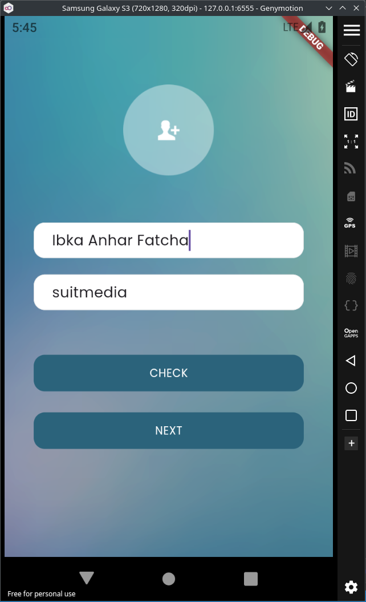
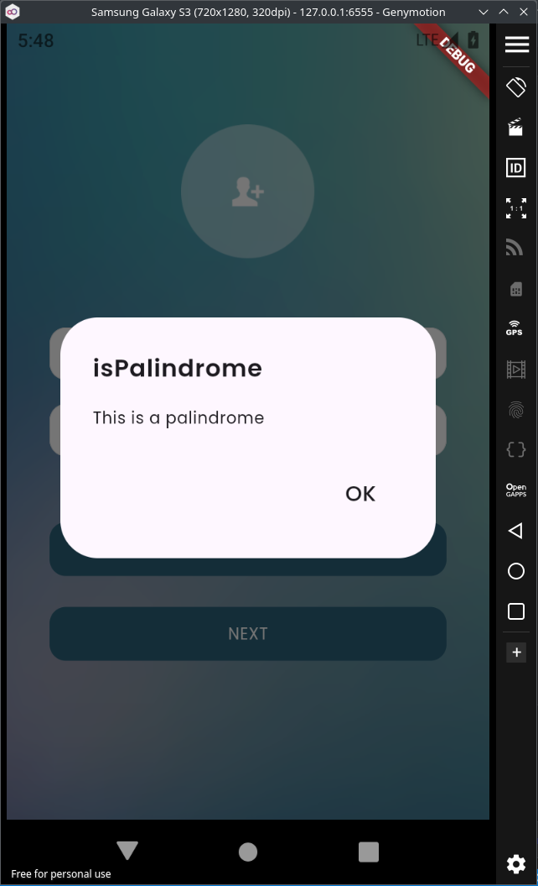
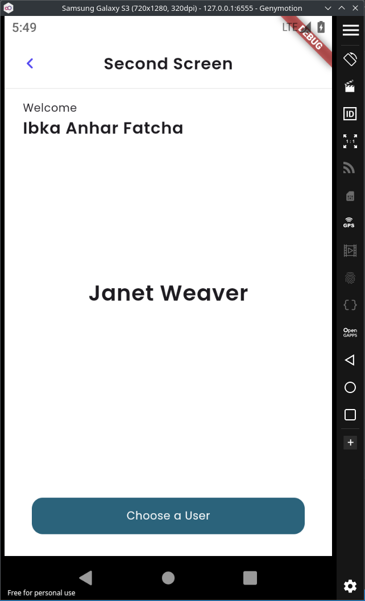
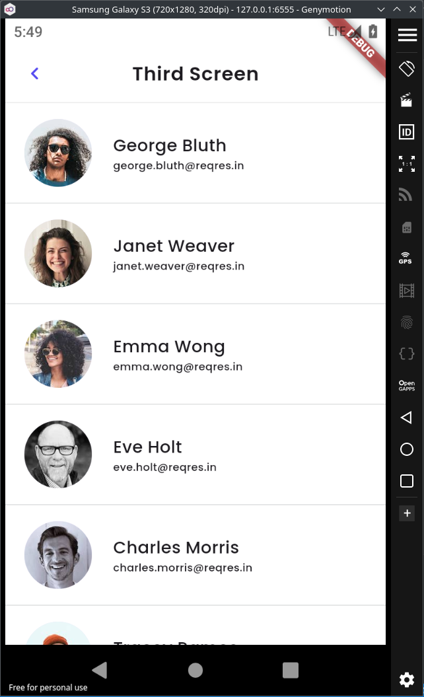

# suitmedia_test

This application built for Suitmedia Internship test using Flutter which met all of the requirements that are given.

## Demo
https://github.com/user-attachments/assets/f29c06d7-c4a5-4d4f-b069-ee011802b15b

## Screenshots

     
     
     
     

